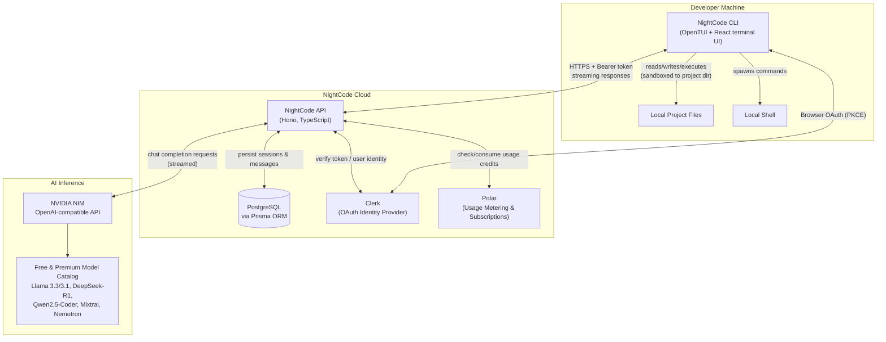
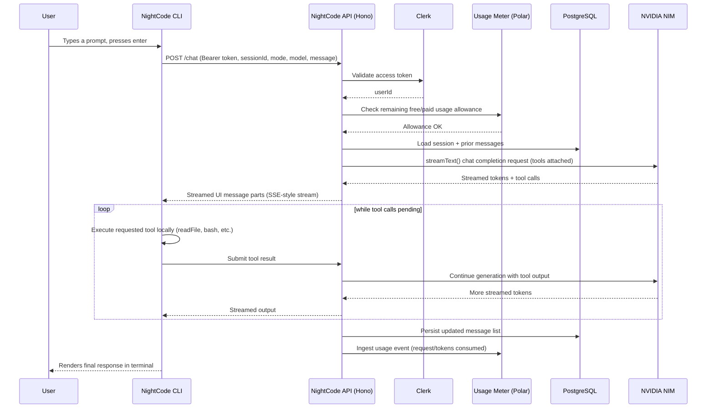
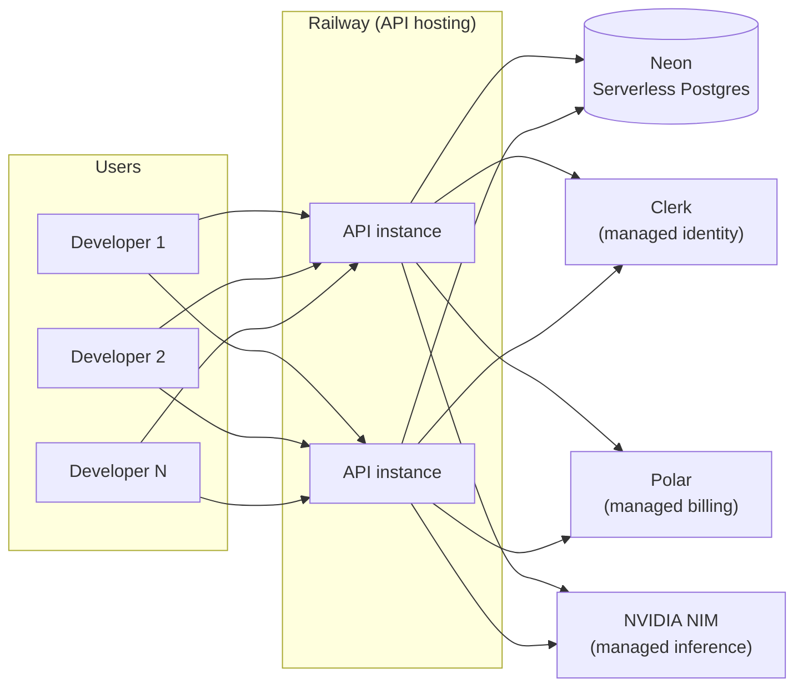

# System Architecture

## 1. Architectural Style

NightCode is a **client-server system** with a thin, locally-installed terminal client and a centralized stateless API. The CLI never talks to the AI provider or the database directly — every AI call, every credential check, and every persisted byte flows through the NightCode API server. The local machine is only trusted to execute file and shell tools inside the current project directory; it holds no long-lived secrets beyond a single OAuth access token.

This split matters for the product's core promise: because the server is the single place that holds the NVIDIA API key, Clerk secret, and database credentials, NightCode can offer every user free access to NVIDIA's model catalog without ever distributing a shared or per-user provider API key to the client.

## 2. High-Level Diagram

## 3. Request Lifecycle: A Single Chat Turn

## 4. Component Responsibilities

### 4.1 CLI (Terminal Client)
- Renders the entire interactive experience inside the terminal using a React-based terminal UI renderer.
- Owns the local OAuth login flow (opens the browser, runs a short-lived local callback server, stores the resulting token).
- Executes all local file-system and shell tools requested by the agent, strictly sandboxed to the current working directory.
- Streams model output token-by-token into the terminal as it arrives from the API.
- Holds no AI provider credentials and makes no direct calls to NVIDIA or any model provider.

### 4.2 API Server
- Single source of truth for identity, sessions, billing state, and AI provider access.
- Verifies every request's bearer token against Clerk before doing any work.
- Resolves the requested model against an internal model registry, rejecting unsupported model IDs.
- Builds the system prompt based on the requested mode (PLAN vs BUILD) and streams the completion from NVIDIA NIM back to the client.
- Persists the full message history for a session after each turn completes.
- Checks and updates usage allowance before and after each billable action.

### 4.3 Database
- Stores durable state: sessions, message history, and (in the Pro tier) subscription/usage records synced from the billing provider.
- Intentionally lean schema — conversation messages are stored as a structured JSON document per session rather than fully normalized per-message rows, favoring simplicity and fast reads for the CLI's access pattern (see [Database Design](./04-database-design.md) for the tradeoffs and a normalized-schema alternative for scale).

### 4.4 Identity Provider (Clerk)
- Issues and validates access tokens for the CLI via an OAuth 2.0 Authorization Code + PKCE flow adapted for a locally-running, browser-driven CLI login.
- The API server never stores passwords or manages credentials directly.

### 4.5 Usage Metering / Billing (Polar)
- Tracks each user's free-tier allowance consumption and, for Pro subscribers, subscription status and any usage above included limits.
- Gates session creation and chat requests behind an allowance check, and ingests a usage event once a response completes.

### 4.6 AI Inference (NVIDIA NIM)
- Provides an OpenAI-compatible chat completions API hosting NightCode's supported model catalog.
- The server treats NIM as a pluggable provider behind an internal model registry, so additional providers (self-hosted models, premium paid endpoints) can be added without changing the chat pipeline (see [AI Model Integration](./07-ai-model-integration.md)).

## 5. Deployment Topology

The API is a stateless HTTP service that can be horizontally scaled behind a load balancer; all durable state lives in the managed Postgres database, and all identity, billing, and inference concerns are delegated to managed third-party platforms. This keeps the operational surface area small enough for a small team to run reliably.

## 6. Why This Shape

1. **Server-mediated AI access is what makes "free for everyone" possible.** A single server-held NVIDIA credential is pooled and rate-limited per user, instead of requiring every developer to register their own provider account.
2. **A thin, stateless client keeps the CLI simple and portable.** Because the client holds no secrets beyond a rotating access token, distributing and updating the CLI carries little security risk.
3. **Separation of PLAN and BUILD modes limits blast radius.** Read-only research is always available with zero risk of unintended file changes; write/execute capability is an explicit, visible mode switch.
4. **Everything durable lives in one managed Postgres instance.** No bespoke storage layer, no client-side database — session history is portable across machines by design.
