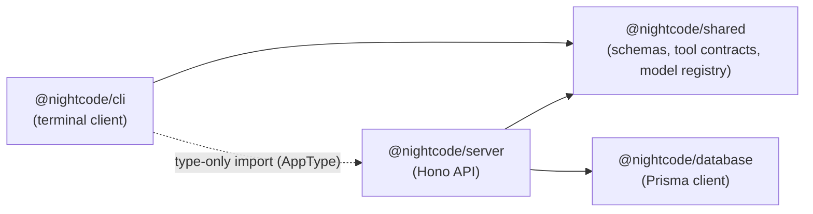

# Monorepo & Project Structure

## 1. Why a Monorepo

NightCode ships four cooperating pieces — a terminal client, an API server, a
database layer, and shared contracts between them — that all need to change
together and stay in lock-step on types. A single Bun-workspace monorepo lets
the team:

- Share Zod schemas and TypeScript types between the CLI and server without
  publishing an internal package to a registry.
- Run one install (`bun install`) to set up every package at once.
- Guarantee the CLI and server always build against the same version of shared
  contracts, since they resolve to local workspace packages rather than pinned
  versions that can drift.
- Ship a typed RPC client: the CLI imports the server's route types directly
  (`AppType`) to get full autocomplete and compile-time errors if a request
  shape ever falls out of sync with the API.

## 2. Top-Level Layout

```
nightcode/
├── package.json                 # workspace root: scripts that fan out to each package
├── bun.lock                     # single lockfile for the whole workspace
├── tsconfig.base.json           # shared compiler config extended by every package
├── .env.example                 # documented list of required environment variables
└── packages/
    ├── cli/                     # terminal client
    ├── server/                  # Hono API
    ├── database/                # Prisma schema + generated client
    └── shared/                  # cross-package schemas, tool contracts, model registry
```

## 3. `packages/cli`

```
packages/cli/
├── bin/
│   └── nightcode                # executable shim installed on the user's PATH
├── src/
│   ├── index.tsx                 # entry point, boots the terminal application
│   ├── components/
│   │   ├── command-menu/         # command palette (search + filter commands)
│   │   ├── dialogs/               # agents, models, sessions, theme dialogs
│   │   ├── messages/              # user/bot/error message renderers
│   │   ├── border.tsx
│   │   ├── header.tsx
│   │   ├── input-bar.tsx
│   │   ├── session-shell.tsx
│   │   ├── spinner.tsx
│   │   └── status-bar.tsx
│   ├── hooks/
│   │   └── use-chat.ts            # streaming chat state hook
│   ├── layouts/
│   │   ├── root-layout.tsx
│   │   └── themed-root.tsx
│   ├── lib/
│   │   ├── api-client.ts          # typed Hono RPC client
│   │   ├── auth.ts                # local token storage (~/.nightcode/auth.json)
│   │   ├── http-errors.ts
│   │   ├── local-tools.ts         # sandboxed file/shell tool execution
│   │   ├── oauth.ts                # browser-based OAuth + PKCE login flow
│   │   └── upgrade.ts              # opens the Pro upgrade / billing portal flow
│   ├── providers/
│   │   ├── dialog/
│   │   ├── keyboard-layer/
│   │   ├── prompt-config/
│   │   ├── theme/
│   │   └── toast/
│   ├── screens/
│   │   ├── home.tsx
│   │   ├── new-session.tsx
│   │   └── session.tsx
│   └── theme.ts
├── package.json
└── tsconfig.json
```

## 4. `packages/server`

```
packages/server/
├── src/
│   ├── index.ts                  # Hono app assembly, route mounting, port config
│   ├── system-prompt.ts          # builds the mode-aware system prompt
│   ├── lib/
│   │   ├── auth.ts                # bearer-token verification against Clerk
│   │   ├── credits.ts             # usage-to-credit conversion logic
│   │   ├── models.ts              # resolves a model id to a live provider instance
│   │   └── polar.ts               # checkout, portal, and usage-ingestion helpers
│   ├── middleware/
│   │   ├── require-auth.ts        # rejects unauthenticated requests
│   │   └── require-credits-balance.ts  # rejects requests once allowance is exhausted
│   └── routes/
│       ├── auth.ts                 # OAuth callback relay
│       ├── billing.ts              # checkout / portal / success endpoints
│       ├── chat.ts                 # streaming chat completion endpoint
│       └── sessions.ts             # session CRUD
├── package.json
└── tsconfig.json
```

## 5. `packages/database`

```
packages/database/
├── prisma/
│   └── schema.prisma             # single source of truth for the data model
├── src/
│   ├── client.ts                  # exported Prisma client singleton
│   └── index.ts                    # re-exports generated Prisma types
├── prisma.config.ts
├── package.json
└── tsconfig.json
```

## 6. `packages/shared`

```
packages/shared/
├── src/
│   ├── models.ts                  # SUPPORTED_CHAT_MODELS registry + pricing/tier metadata
│   ├── schemas.ts                  # Zod schemas: modes, tool input contracts
│   └── index.ts
├── package.json
└── tsconfig.json
```

## 7. Package Dependency Graph



The CLI's only runtime dependency on the server package is through the
`hono/client` typed RPC client, and that import is type-only — the CLI never
bundles server code, it only borrows the server's route type signatures at
compile time for end-to-end type safety.

## 8. Root Scripts

| Script                                        | Purpose                                                                           |
| --------------------------------------------- | --------------------------------------------------------------------------------- |
| `bun run dev:cli`                             | Runs the CLI in watch mode against a locally running server                       |
| `bun run dev:server`                          | Runs the API with hot reload                                                      |
| `bun run build:cli`                           | Bundles the CLI into a standalone executable target                               |
| `bun run link:cli`                            | Builds and symlinks the `nightcode` binary onto the local PATH for manual testing |
| `bun run --cwd packages/database db:generate` | Regenerates the Prisma client from `schema.prisma`                                |

## 9. Naming Convention

Every workspace package is namespaced under `@nightcode/*` (`@nightcode/cli`,
`@nightcode/server`, `@nightcode/database`, `@nightcode/shared`) and resolved
locally via Bun workspace protocol (`workspace:*`) rather than published to a
public registry — these are internal packages that exist only to share code
within the monorepo, not standalone libraries.
