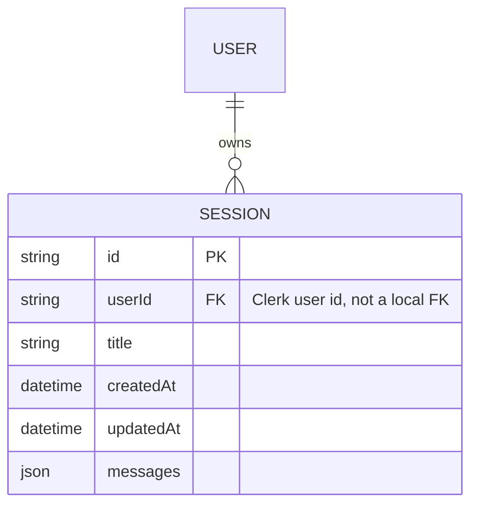
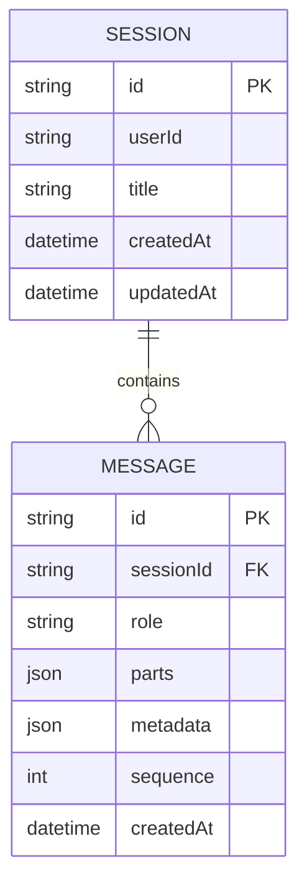

# Database Design

## 1. Database Choice

NightCode uses **PostgreSQL**, accessed exclusively through **Prisma ORM** from the API server. Neon is the recommended managed provider because it offers serverless connection pooling and instant branch databases for preview environments, but any standard Postgres instance works — the schema has no Neon-specific features.

The database is intentionally the *only* persistent store in the system. The CLI holds no local database; everything durable — sessions, message history, and (for Pro accounts) subscription state — lives server-side so a user's work follows them across machines the moment they log in.

## 2. Core Schema

```prisma
// packages/database/prisma/schema.prisma

generator client {
  provider = "prisma-client"
  output   = "../generated/prisma"
}

datasource db {
  provider = "postgresql"
}

model Session {
  id        String   @id @default(cuid())
  userId    String
  title     String
  createdAt DateTime @default(now())
  updatedAt DateTime @updatedAt
  messages  Json     @default("[]")

  @@index([userId])
}
```

## 3. Entity-Relationship Diagram



Note that `User` is not a table in NightCode's own database — Clerk is the system of record for identity, and `Session.userId` stores Clerk's user identifier as an opaque string. NightCode never duplicates profile data (name, email) locally; anything user-identifying is fetched from Clerk on demand, which keeps the local schema minimal and avoids a second source of truth for PII.

## 4. Why `messages` Is a JSON Column, Not a Normalized Table

This is the single most consequential schema decision in the system, so it's worth explaining explicitly rather than leaving it implicit.

**The access pattern that drives this decision:** every read of a session loads its *entire* message history at once — there is no use case in the product for querying an individual message across sessions, filtering messages by type server-side, or paginating within a session. The CLI always wants "give me this whole conversation," and the AI SDK already represents a conversation as an ordered array of richly-typed message objects (with nested parts: text, tool calls, tool results, reasoning).

Given that access pattern, storing the whole message array as a single JSON document per session has real advantages:

- **One round trip.** Loading a session is a single indexed lookup by `id`/`userId`, not a join across a `messages` table ordered and paginated.
- **No serialization mismatch.** The AI SDK's message format is a nested, evolving TypeScript type (new part types get added as the SDK adds capabilities like reasoning tokens or new tool-call shapes). Storing it as JSON means the persistence layer never has to be migrated in lockstep with the AI SDK's message schema — only the application-level Zod validation needs to track that.
- **Atomic updates.** Appending a new turn to a conversation is a single `UPDATE ... SET messages = $1 WHERE id = $2`, which is trivially consistent — no risk of partial writes leaving a conversation half-persisted across multiple rows.

**The tradeoff, stated plainly:** this design does not scale indefinitely. A single JSON column has no way to index into the *content* of individual messages, and every update rewrites the entire document, which becomes more expensive as a conversation grows very long (thousands of turns). For the product's actual usage pattern — bounded, human-paced coding conversations — this cost is negligible. It would become a real constraint if NightCode later wanted server-side full-text search across message history, cross-session analytics on tool usage, or extremely long-running automated agent sessions with tens of thousands of turns.

### 4.1 Normalized Alternative (documented for future scale)

If/when that constraint is hit, the natural evolution is:



This would let the server paginate long conversations, index on `role` or `sequence`, and run analytics queries (e.g. "how often is the `bash` tool used per session") without loading full conversations into memory. It is intentionally *not* the initial schema, because it adds join complexity and migration overhead the product doesn't need yet — this is a deliberate "start simple, document the scaling path" decision rather than an oversight.

## 5. Indexing Strategy

- `@@index([userId])` on `Session` supports the two dominant queries: "list all of a user's sessions" (session picker dialog) and "load one session, scoped to its owner" (every session read/write is filtered by both `id` and `userId` to prevent cross-account access at the query level, not just at the authorization layer).
- `id` uses Prisma's `cuid()` default — collision-resistant, sortable-enough for creation-order use cases, and safe to expose in API responses and CLI output without leaking sequential/guessable identifiers.

## 6. Billing-Related Data

Usage allowance and subscription state (free-tier daily grants, Pro subscription status, plan tier) are **not** duplicated into NightCode's own database. Polar is the system of record for billing state; the server queries Polar's API for a user's current allowance at request time (see [Usage Limits & Billing](./09-usage-limits-and-billing.md)) rather than mirroring subscription data locally. This avoids a whole class of billing-state drift bugs (a plan changing in the billing provider but not being reflected locally) at the cost of one extra network call per gated request — an acceptable tradeoff given gated requests are already making an outbound AI inference call.

## 7. Migration Workflow

Schema changes go through standard Prisma migration tooling:

```bash
# generate the Prisma client after editing schema.prisma
bun run --cwd packages/database db:generate

# create and apply a migration in development
bunx prisma migrate dev --name <migration-name>

# apply pending migrations in production (CI/CD step)
bunx prisma migrate deploy
```

Because the schema currently has a single model, migrations are low-risk; as the normalized-message alternative (Section 4.1) is introduced, migrations will need a backfill step to convert existing JSON `messages` documents into rows — that backfill script should be written and rehearsed against a production data snapshot before the corresponding migration ships.
