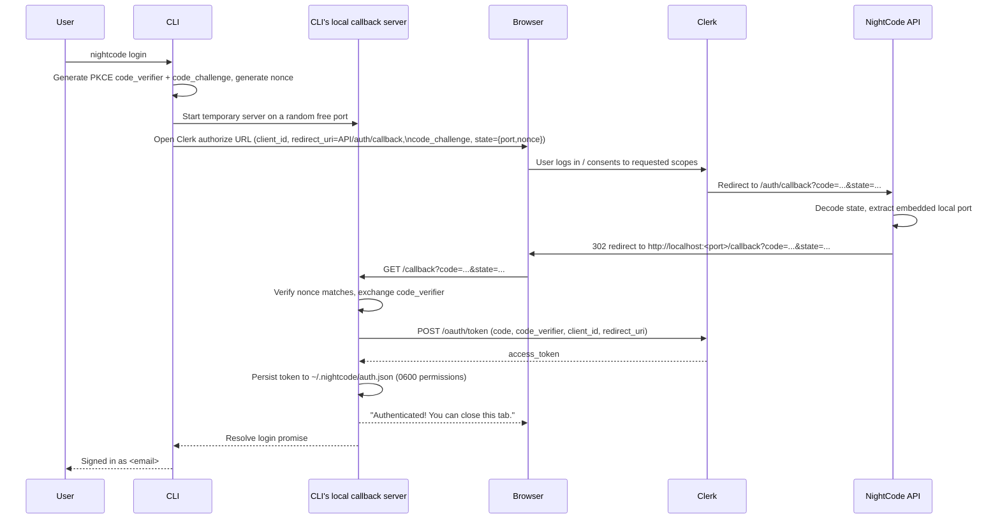

# Authentication & OAuth

## 1. Why OAuth From a CLI

NightCode needs to authenticate a command-line tool — something with no browser,
no web session cookies, and no secure place to embed a client secret — against a
managed identity provider (Clerk) that speaks standard OAuth 2.0. The solution
is the **Authorization Code flow with PKCE (Proof Key for Code Exchange)**,
adapted so the "redirect URI" ultimately lands back on a short-lived local HTTP
server the CLI spins up on the user's own machine.

This gives NightCode a real, auditable identity for every user (name, email,
account) without the CLI ever holding a client secret, and without asking users
to copy-paste tokens between a browser and a terminal.

## 2. Login Sequence



## 3. Why the Server Sits in the Middle

Clerk's OAuth application is configured with a single fixed redirect URI (the
NightCode API's `/auth/callback`), not a dynamic `localhost:<random-port>` URI,
because most identity providers only allow a small, pre-registered set of
redirect URIs for security reasons — they won't accept an arbitrary,
attacker-controllable port at authorization time. NightCode's API server acts as
a fixed, trusted relay: it receives the callback at its one registered URI,
reads the _port_ the CLI embedded inside the `state` parameter, and forwards the
browser to that port on `localhost`. Because the initiating CLI process is the
only thing listening on that specific ephemeral port on the user's own machine,
the code can only be redeemed by the process that started the flow.

## 4. PKCE, Explained

PKCE closes the gap that would otherwise exist because the CLI is a "public
client" — it cannot hold a secret the way a server-side web app can (anyone can
read a CLI's source or memory). Instead of a static secret, the CLI:

1. Generates a random `code_verifier` (32 random bytes, base64url-encoded) and
   keeps it in memory only.
2. Derives a `code_challenge` as `SHA-256(code_verifier)`, sent up front with
   the authorization request.
3. Later, when exchanging the authorization code for a token, sends the original
   `code_verifier`.

Clerk verifies the hash of the presented `code_verifier` matches the
`code_challenge` it received earlier — proving the token exchange request is
coming from the same process that initiated the login, even though nothing
long-lived or secret was ever stored on disk during the flow.

## 5. State Parameter & CSRF/Replay Protection

The `state` parameter serves two purposes simultaneously:

- **Routing:** it encodes the ephemeral local callback port so the server-side
  relay knows where to forward the browser.
- **Integrity:** it embeds a random `nonce` generated at flow start and checked
  against the value returned in the callback, preventing a maliciously crafted
  callback from being accepted by a stale or unrelated CLI process.

## 6. Requested Scopes

The OAuth application requests exactly four scopes: `openid`, `email`,
`profile`, `offline_access`. `offline_access` is requested so NightCode's access
tokens can be refreshed/rotated without forcing a full interactive re-login on
every expiry — but a Public OAuth application's issued access token (not a
refresh flow the CLI itself drives) is what's actually persisted client-side;
token lifetime and rotation policy live in the Clerk dashboard.

## 7. Token Storage on Disk

```text
~/.nightcode/auth.json
```

- The containing directory is created with owner-only permissions (`0700`).
- The token file itself is written with owner-only read/write permissions
  (`0600`).
- This prevents other local users on a shared machine from reading the token,
  though it does not protect against a compromise of the user's own account on
  that machine — the same trust boundary as SSH keys or any other CLI-stored
  credential.

## 8. Server-Side Verification

Every protected API route runs through an authentication middleware that:

1. Extracts the bearer token from the `Authorization` header.
2. Validates it against Clerk (signature, expiry, issuer).
3. Attaches the resolved `userId` onto the request context for downstream
   handlers (sessions, chat, billing) to scope all data access to.
4. Returns `401 { "error": "Unauthorized. Run /login to continue." }` on any
   failure, giving the user an actionable next step directly in the error
   message rather than a bare status code.

## 9. Logout

`nightcode logout` deletes `~/.nightcode/auth.json` locally. Because the CLI
holds no server-side session state of its own — the server only ever validates
tokens against Clerk, it never stores a session row per login — logout is purely
a local, client-side action; no server round trip is required.

## 10. Threat Model Summary

| Risk                                          | Mitigation                                                                                                                            |
| --------------------------------------------- | ------------------------------------------------------------------------------------------------------------------------------------- |
| Stolen client secret                          | None exists — Public client + PKCE means there is no long-lived secret to steal.                                                      |
| Authorization code interception               | PKCE `code_verifier`/`code_challenge` binds the code to the originating process.                                                      |
| Malicious redirect to attacker's local server | Fixed, Clerk-registered redirect URI on the NightCode API; only the port varies, and it's bound to a random nonce checked on receipt. |
| Token theft from disk                         | Owner-only file permissions; recommend full-disk encryption as a baseline OS-level control (outside NightCode's scope).               |
| Replay of an old callback                     | Nonce comparison rejects mismatched or stale state values.                                                                            |
