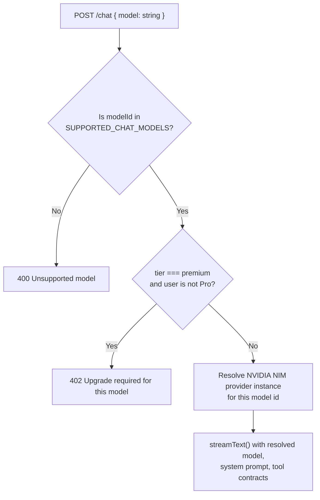

# AI Model Integration — NVIDIA NIM

## 1. Why NVIDIA NIM

NVIDIA NIM (NVIDIA Inference Microservices) hosts a large catalog of open-weight
foundation models — including Meta's Llama family, DeepSeek's reasoning models,
Alibaba's Qwen coding models, Mistral's mixture-of-experts models, and NVIDIA's
own Nemotron alignment-tuned models — behind a single, OpenAI-compatible chat
completions API, with a free tier of API credits available to any developer with
an NVIDIA account.

This is the architectural and business foundation of NightCode: because NVIDIA
exposes these models through the _same request/response contract_ as OpenAI's
Chat Completions API, NightCode's server can plug NVIDIA NIM into its existing
AI SDK-based streaming pipeline as just another OpenAI-compatible provider — no
bespoke request/response translation layer, no custom streaming parser, no
separate tool-calling protocol to support.

## 2. Provider Configuration

```ts
// packages/server/src/lib/models.ts (conceptual)
import { createOpenAICompatible } from "@ai-sdk/openai-compatible";

const nvidia = createOpenAICompatible({
  name: "nvidia-nim",
  baseURL: "https://integrate.api.nvidia.com/v1",
  apiKey: process.env.NVIDIA_API_KEY,
});
```

A single server-held `NVIDIA_API_KEY` is used for every user's request — this is
the mechanism that lets NightCode offer free model access to end users without
each of them needing their own NVIDIA account or API key. The server pools and
rate-limits usage per NightCode user (see
[Usage Limits & Billing](./09-usage-limits-and-billing.md)) independently of
whatever quota NVIDIA applies to the pooled key itself.

## 3. Supported Model Registry

Exactly like the rest of the system's "registry" pattern (tool contracts, mode
definitions), supported models are declared once in the shared package and
referenced by ID everywhere else — the chat route, the credits/usage calculator,
and the CLI's model-picker dialog all resolve against this single list, so
adding or retiring a model is a one-file change.

```ts
// packages/shared/src/models.ts (conceptual)
export type ModelTier = "free" | "premium";

export const SUPPORTED_CHAT_MODELS = [
  {
    id: "meta/llama-3.3-70b-instruct",
    provider: "nvidia-nim",
    tier: "free",
    label: "Llama 3.3 70B",
    description: "Default general-purpose coding and reasoning model.",
  },
  {
    id: "meta/llama-3.1-405b-instruct",
    provider: "nvidia-nim",
    tier: "free",
    label: "Llama 3.1 405B",
    description: "Flagship-scale model for complex, multi-step reasoning.",
  },
  {
    id: "deepseek-ai/deepseek-r1",
    provider: "nvidia-nim",
    tier: "free",
    label: "DeepSeek-R1",
    description:
      "Extended chain-of-thought reasoning model, strong on multi-step debugging.",
  },
  {
    id: "qwen/qwen2.5-coder-32b-instruct",
    provider: "nvidia-nim",
    tier: "free",
    label: "Qwen 2.5 Coder 32B",
    description:
      "Coding-specialized model tuned for code generation and completion.",
  },
  {
    id: "mistralai/mixtral-8x22b-instruct-v0.1",
    provider: "nvidia-nim",
    tier: "free",
    label: "Mixtral 8x22B",
    description:
      "Fast mixture-of-experts model, good default for short, latency-sensitive turns.",
  },
  {
    id: "nvidia/llama-3.1-nemotron-70b-instruct",
    provider: "nvidia-nim",
    tier: "free",
    label: "Nemotron 70B",
    description:
      "NVIDIA-tuned model optimized for instruction-following and helpfulness.",
  },
] as const;

export const DEFAULT_CHAT_MODEL_ID = "meta/llama-3.3-70b-instruct";
```

All six launch models are on NVIDIA's free tier. The registry's `tier` field
exists so that premium, paid NVIDIA-hosted endpoints (higher-throughput
dedicated capacity, larger context windows, or newer models NVIDIA prices
separately) can be added later and gated behind the Pro plan without any change
to the chat pipeline itself — only the registry and the usage-gating middleware
need to know a given model is `premium`.

## 4. Resolving a Model at Request Time



The server never trusts a raw model string from the client beyond validating it
against the registry — this closes off both accidental typos and any attempt to
request a model NightCode hasn't explicitly reviewed and priced/tiered.

## 5. Streaming & Tool Calling

Because NVIDIA NIM's API is OpenAI-compatible end to end, the same Vercel AI SDK
primitives NightCode already uses for orchestration work unmodified:

- `streamText()` streams incremental tokens back to the client as
  Server-Sent-Events-style chunks.
- Tool-calling uses the same structured function-calling contract as OpenAI's
  API — when the model wants to call `readFile` or `bash`, NVIDIA NIM emits the
  same tool-call payload shape the AI SDK already knows how to parse, pause on,
  and resume after a tool result is supplied.
- Reasoning-capable models (DeepSeek-R1 in particular) stream additional
  "thinking"/reasoning content, which the AI SDK surfaces as a distinct message
  part type so the terminal UI can render it (dimmed, collapsible) separately
  from the final answer.

No provider-specific branching is needed in the chat route itself —
`resolveChatModel(modelId)` returns a ready-to-use model handle regardless of
which underlying NVIDIA-hosted model was requested.

## 6. Rate Limits & Reliability

NVIDIA's free tier applies its own request-rate and concurrency limits to the
pooled API key. NightCode's server treats a `429` from NVIDIA NIM as a distinct
failure mode from a user-facing allowance exhaustion:

| Failure                                                | Source                  | User-facing behavior                                                                                                             |
| ------------------------------------------------------ | ----------------------- | -------------------------------------------------------------------------------------------------------------------------------- |
| NightCode's own free-tier daily allowance exhausted    | NightCode's usage meter | `402`, "Run `/upgrade` for more"                                                                                                 |
| NVIDIA NIM pooled key hitting provider-side rate limit | NVIDIA NIM              | `503`, "AI provider is busy, please retry in a moment" — the server does not charge allowance for a request that never completed |
| Requested model temporarily unavailable at NVIDIA      | NVIDIA NIM              | Falls back to the default model with a visible notice in the terminal, rather than failing the turn outright                     |

This distinction matters commercially as much as technically: a user should
never feel like a shared infrastructure limit is being billed against their
personal free allowance.

## 7. Extensibility: Adding a New Provider

Because the model registry stores a `provider` field per model and
`resolveChatModel` dispatches on it, adding a second inference provider (a
different free catalog, a self-hosted model, or a premium paid endpoint from any
vendor) is additive:

1. Add a new provider client configuration alongside the NVIDIA NIM one.
2. Add new entries to `SUPPORTED_CHAT_MODELS` with the new `provider` value.
3. Extend the resolver's switch statement to construct the right provider
   instance for that value.

No changes are required to the chat route, the tool-calling pipeline, the
credits calculator's interface, or the CLI's model picker — they all operate
against the registry and the resolver's output type, not against any specific
provider.

## 8. Why This Matters for the Product

Every architectural choice in this section exists in service of one product
claim: **a brand-new user can install NightCode, log in, and start getting real
AI coding assistance from frontier-class open models in under a minute, without
ever entering a payment method.** The provider abstraction is what makes that
claim durable — NVIDIA's free tier is generous today, but the same
registry-and-resolver pattern is what lets NightCode add capacity, add
providers, or rebalance which models are free vs. premium over time without a
rewrite.
