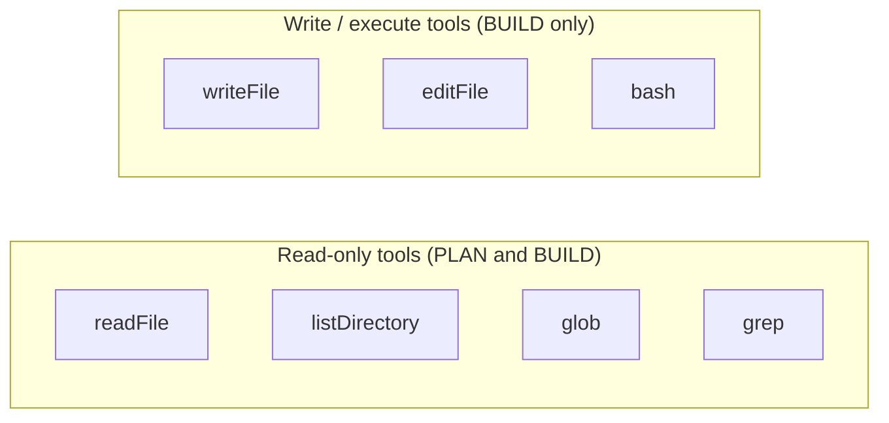
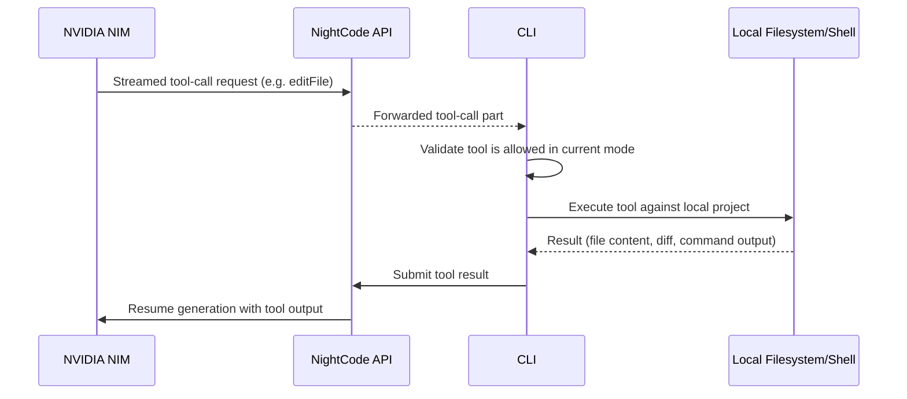

# Agent Modes & Tool System

## 1. Two Modes, One Mental Model

NightCode's agent operates in exactly one of two explicit modes at any time, chosen by the user before or during a session:

- **PLAN** — read-only research and proposal. The agent can explore the codebase but cannot change anything.
- **BUILD** — full implementation. The agent gains write, edit, and shell-execution capability on top of everything PLAN can do.

This binary split exists so a user always knows, at a glance, whether the agent they're talking to *can* touch their files. There is no intermediate "ask me before each write" mode by design — mode switching itself is the confirmation gesture; a user consciously opts into BUILD before the agent is ever capable of mutating anything.

## 2. Tool Contracts

Tools are declared once, centrally, as shared schema + description pairs, and the *set* of tools attached to a model call is entirely determined by the current mode:



| Tool | Mode | Description |
|---|---|---|
| `readFile` | PLAN, BUILD | Reads a file's contents (path relative to the project root). |
| `listDirectory` | PLAN, BUILD | Lists entries in a directory. |
| `glob` | PLAN, BUILD | Finds files matching a glob pattern. |
| `grep` | PLAN, BUILD | Searches file contents with a regular expression. |
| `writeFile` | BUILD only | Creates or overwrites a file. |
| `editFile` | BUILD only | Replaces an exact, unique string match within a file — the model must supply enough surrounding context that the target text is unambiguous. |
| `bash` | BUILD only | Runs a shell command with a bounded timeout. |

The model only ever sees the tool definitions valid for the current mode — a PLAN-mode request never even offers `writeFile` as a callable function, so there is no reliance on the model "choosing" not to write; the capability simply doesn't exist in that request's tool list.

## 3. Where Tools Actually Execute

This is a critical architectural point: **tool execution happens on the client, not the server.** The server only ever *requests* a tool call as part of orchestrating the model's turn; the CLI intercepts that request, runs the actual file/shell operation against the user's local machine, and reports the result back to continue the model's generation.



The server has no filesystem or shell access to the user's machine at all — it is architecturally incapable of reading or modifying a user's project, even if compromised, because it never runs on the user's machine and never receives credentials that would let it reach it directly. All local capability lives in the CLI process the user themselves launched.

## 4. Sandboxing Rules

Every local tool enforces the same containment rule before doing anything else: **the resolved path must stay inside the current working directory the CLI was launched from.**

```ts
function resolveInsideCwd(path: string) {
  const cwd = process.cwd();
  const resolved = resolve(cwd, path);
  const rel = relative(cwd, resolved);

  if (rel.startsWith("..") || isAbsolute(rel)) {
    throw new Error("Path is outside the project directory");
  }

  return { cwd, resolved };
}
```

Any tool call that would touch `../../etc/passwd`, an absolute path outside the project, or otherwise escape the current directory via `..` traversal is rejected before any filesystem call is made. This applies uniformly to `readFile`, `writeFile`, `editFile`, `listDirectory`, `glob`, and `grep` — the model cannot use the agent to explore or modify anything outside the folder the user explicitly opened NightCode in.

`bash` is scoped by working directory (`cwd` is pinned to the project root for every spawned command) but is inherently the least containable tool, since a shell command can itself invoke absolute paths or navigate elsewhere. This is a deliberate, disclosed tradeoff: `bash` exists precisely because arbitrary shell access (running tests, git commands, package installs) is core to what makes BUILD mode useful, and the tradeoff is documented, not hidden — see [Security Architecture](./12-security-architecture.md) §5 for the full threat discussion and recommended mitigations for security-sensitive environments (e.g. running NightCode inside a container or VM for untrusted repositories).

## 5. Output Bounding

Every tool enforces limits to keep both the model's context window and the terminal UI responsive:

| Limit | Value | Applies to |
|---|---|---|
| Max file read size | 10,000 characters | `readFile` (larger files are truncated with a `truncated: true` flag and the true total length reported) |
| Max results returned | 200 entries | `glob` |
| Max matches returned | 50 | `grep` |
| Max combined stdout/stderr | 20,000 characters | `bash` |
| Default command timeout | 30 seconds (configurable per call) | `bash` |

These limits exist to prevent a single tool call from either derailing the model with an overwhelming amount of content or hanging the terminal session on a runaway command — they are safety valves, not artificial product restrictions, and they apply identically regardless of which NVIDIA-hosted model is driving the conversation.

## 6. `editFile` Precision Requirement

`editFile` deliberately requires the model to supply an `oldString` that appears **exactly once** in the target file. If the string is missing, the tool errors with "oldString not found in file"; if it's ambiguous, it errors with the number of matches found. This forces the model toward precise, surgical edits with enough surrounding context to be unambiguous, rather than allowing vague or accidentally destructive replacements — and it gives the model itself immediate, actionable feedback it can use to retry with more context, without any file having been touched.

## 7. Mode Enforcement Is Layered, Not Single-Point

Mode restrictions are checked in two independent places, not just one:

1. **At the model layer** — only PLAN-mode tool contracts are ever sent to the model during a PLAN session, so a PLAN-mode model has no way to even emit a `writeFile` tool call.
2. **At the execution layer** — the CLI's local tool executor independently re-checks the current mode before running any tool, and refuses to execute a write/exec tool if the mode is PLAN, regardless of what the model requested.

This defense-in-depth matters because it removes any single point of failure: even if a future model somehow emitted a disallowed tool call outside its offered contract (a model bug, a prompt injection attempt embedded in file content the model read, etc.), the client-side execution layer is the final, non-negotiable gate before anything touches disk.

## 8. Mode Switching Mid-Session

Users can switch between PLAN and BUILD within a single session at any time via the command palette. Switching modes does not clear conversation history — the model retains full context of everything discussed in PLAN mode when the user promotes the session to BUILD to actually implement the agreed plan, which mirrors the natural "research together, then build" workflow the two-mode design is meant to support.
