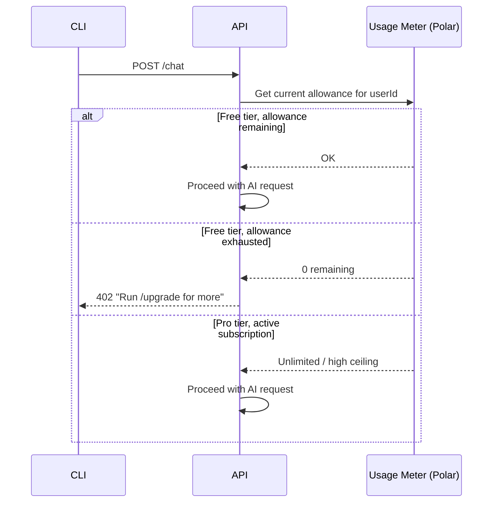
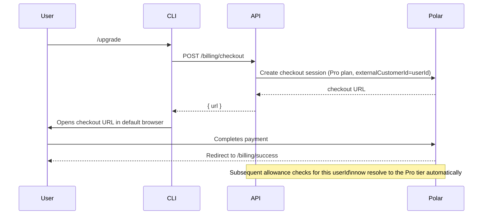

# Usage Limits & Billing

## 1. Design Goal

NightCode's entire premise is that a developer should be able to use a
frontier-class AI coding agent without paying per token. That goal shapes
billing architecture as much as it shapes the product pitch: the system still
needs _some_ gate to prevent abuse of a shared, pooled NVIDIA API key, but that
gate must never feel like metered billing to an honest user operating within
reasonable bounds.

NightCode resolves this with a **two-tier fair-use model**:

- **Free tier (default for every account):** a generous, resetting daily
  allowance of requests against NVIDIA's free model catalog. No payment method
  required, ever, to use this tier.
- **Pro tier (optional subscription):** removes daily caps, adds priority
  throughput during high load, and unlocks premium hosted models. Billed and
  managed through Polar.

## 2. Why Keep a Billing Layer At All

Even with $0 model cost, a shared pooled API key has finite throughput. Without
_some_ per-user ceiling, a small number of high-volume or automated users could
exhaust the shared allowance and degrade the experience for everyone else. The
billing layer's job in NightCode is therefore **fairness enforcement**, not
**revenue extraction** — the free tier is not a crippled trial designed to
convert users, it's the intended default experience for the overwhelming
majority of users, sized generously enough that a normal working developer never
hits the ceiling in normal use.

Pro exists for the minority of users who genuinely need more — automated
workflows, teams sharing a single power-user's usage pattern, or anyone who
wants priority scheduling during peak load — and its revenue funds the pooled
NVIDIA capacity, database hosting, and premium model access for everyone.

## 3. Allowance Model

| Tier     | Daily allowance                                          | Reset                   | Model access                         | Priority                        | Price                |
| -------- | -------------------------------------------------------- | ----------------------- | ------------------------------------ | ------------------------------- | -------------------- |
| **Free** | 300 requests/day (fair-use, generous default)            | Rolls over at 00:00 UTC | Full free NVIDIA NIM catalog         | Standard queue                  | $0                   |
| **Pro**  | Unlimited (subject to NVIDIA's own upstream rate limits) | N/A                     | Free catalog + premium hosted models | Priority queue during peak load | Monthly subscription |

A "request" is one billable chat turn (one `/chat` call that completes
successfully) or one new session creation — the same gate
(`requireCreditsBalance`-style middleware) protects both actions, since a
session with no ability to chat is worthless, and gating only chat would let
users spin up unlimited empty sessions.

## 4. Allowance Check Flow



This check happens **before** any call to NVIDIA NIM — a user who has exhausted
their allowance never triggers a model call at all, so there's no wasted
inference capacity spent on a request that will be rejected anyway.

## 5. Usage Ingestion After Completion

Once a chat turn streams to completion (and was not aborted mid-stream, and has
no pending tool calls still awaiting resolution), the server records one usage
event against the user's meter:

```ts
await ingestAiUsage({
  externalCustomerId: userId,
  eventId: `chat-message:${responseMessage.id}`,
  requests: 1,
});
```

Using the response message's own ID as the idempotency key (`eventId`) means a
retried or duplicated ingestion call — for example, due to a transient network
blip — can never double-count the same completed turn against a user's daily
allowance.

## 6. Why Polar

Polar was chosen as the billing/metering provider because it treats
**usage-based metering** as a first-class primitive (not just subscription
toggles), which matches NightCode's actual need: track a per-user, resetting
counter, gate access when it hits zero, and separately support a flat-rate Pro
subscription that bypasses the counter entirely. The same provider handles both
the free-tier fairness counter and the Pro subscription lifecycle (checkout,
portal, cancellation), so there's one billing system to operate, not two.

## 7. Upgrade Flow



No webhook-driven local state sync is required for the allowance check itself —
because the server queries Polar directly at request time rather than mirroring
subscription status into its own database (see
[Database Design](./04-database-design.md) §6), a completed upgrade takes effect
on the very next request with no propagation delay or local cache to invalidate.

## 8. Managing an Existing Subscription

`nightcode billing` opens a Polar-hosted customer portal
(`POST /billing/portal`) where a Pro subscriber can update payment details, view
invoices, or cancel — NightCode does not build or maintain any of this UI
itself, it delegates entirely to Polar's hosted portal, which keeps the surface
area of custom billing code small and reduces PCI-scope exposure to essentially
zero (NightCode's servers never see card details).

## 9. Failure Handling Philosophy

| Failure                                                                        | Behavior                                                                                                                                                                                                                              |
| ------------------------------------------------------------------------------ | ------------------------------------------------------------------------------------------------------------------------------------------------------------------------------------------------------------------------------------- |
| Allowance-check call to Polar fails/times out                                  | `503`, "Unable to verify usage allowance right now" — fail closed on the _gate_ to protect shared capacity, but this is explicitly logged and alerted on, since it directly blocks legitimate users.                                  |
| Usage-ingestion call fails _after_ a response was already streamed to the user | Logged server-side only; the user is never shown an error for a turn they already received a complete answer to. Under-counting a rare failed ingestion is preferable to retroactively punishing a user for a successful interaction. |

## 10. Non-Goals

The billing system deliberately does **not**:

- Charge per-token or per-model — all free-tier models cost the same "1 request"
  regardless of which NVIDIA-hosted model answered, keeping the mental model
  simple for users.
- Require a credit card to start using the product at all.
- Expose NVIDIA's own infrastructure costs or rate limits to end users directly
  — the free/Pro distinction is entirely a NightCode-level fairness policy, not
  a pass-through of upstream provider pricing.
