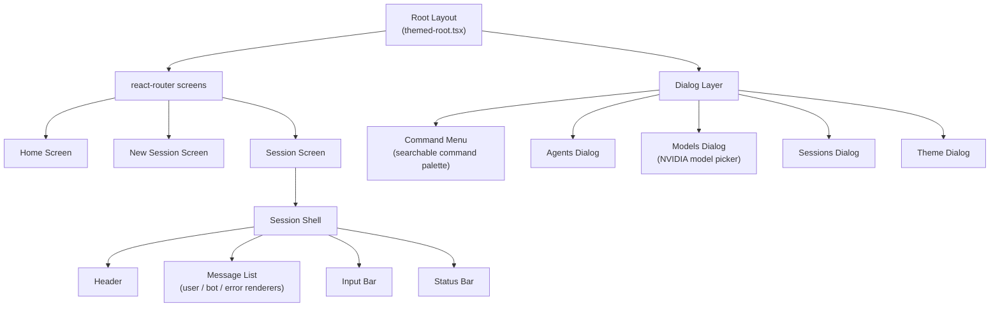

# Terminal UI Architecture

## 1. Why a Real UI Framework, Not a Text REPL

Most terminal AI tools are either a bare read-eval-print loop (print a prompt,
read a line, print a response) or a heavyweight TUI library with an imperative,
hand-rolled rendering model. NightCode instead renders its entire interface as a
**React component tree**, targeting the terminal through a custom renderer
rather than the DOM. This gives the team declarative components, state and
effect hooks, context providers, and composition — the same patterns used to
build the rest of the system — applied to boxes, text, and input fields drawn
with terminal escape sequences instead of HTML.

## 2. Component Architecture

## 3. Providers

NightCode's terminal app is wrapped in a stack of React context providers,
mirroring the provider-composition pattern common in web React apps:

| Provider         | Responsibility                                                                                                                                                                               |
| ---------------- | -------------------------------------------------------------------------------------------------------------------------------------------------------------------------------------------- |
| `theme`          | Current color theme; consumed by every visual component so theme switching is instant and global.                                                                                            |
| `dialog`         | Which modal dialog (if any) is currently open, and how to open/close it from anywhere in the tree.                                                                                           |
| `keyboard-layer` | Manages layered keyboard shortcut scopes — e.g. the command palette's shortcuts take precedence over the input bar's shortcuts while it's open, and layers pop cleanly when a dialog closes. |
| `prompt-config`  | Tracks the active mode (PLAN/BUILD) and selected model for the current session.                                                                                                              |
| `toast`          | Ephemeral, non-blocking notifications (e.g. "Switched to BUILD mode", "Upgraded to Pro").                                                                                                    |

## 4. Screens

- **Home** — landing screen after launch: recent sessions, quick actions (new
  session, resume last session, open command palette).
- **New Session** — session title entry and initial mode/model selection before
  the first message is sent.
- **Session** — the primary work surface: streaming message list, input bar,
  live status (mode, model, tool activity).

Screen-to-screen navigation uses `react-router`, so the mental model (routes,
navigation, params) is identical to a web app despite rendering to a terminal.

## 5. Streaming Message Rendering

The `use-chat` hook wraps the AI SDK's client-side chat state management,
exposing a live-updating array of message parts as tokens arrive from `/chat`.
Message rendering distinguishes part types so each renders appropriately in real
time:

| Part type                                                  | Rendering behavior                                                                                                                        |
| ---------------------------------------------------------- | ----------------------------------------------------------------------------------------------------------------------------------------- |
| Text                                                       | Streamed character-by-character (or in small chunks) into the current message bubble.                                                     |
| Reasoning (from reasoning-capable models like DeepSeek-R1) | Rendered dimmed/collapsible, visually distinct from the final answer.                                                                     |
| Tool call                                                  | Rendered as a compact, live-updating status line ("Reading `src/index.ts`…") that resolves into a result summary once the tool completes. |
| Tool result                                                | Collapsed by default (e.g. full file contents), expandable on demand so the terminal doesn't get flooded by large outputs.                |
| Error                                                      | Rendered via a distinct error-message component with a clear, actionable message rather than a raw stack trace.                           |

## 6. The Command Menu

A searchable, fuzzy-filterable command palette (opened via a global keyboard
shortcut) is the primary way users discover and trigger actions without
memorizing flags or slash commands — `/login`, `/logout`, `/upgrade`, `/theme`,
switching mode, switching model, and opening the sessions list are all exposed
as filterable commands with clear labels, following the same interaction pattern
developers already know from editor command palettes (e.g. VS Code's
`Cmd+Shift+P`).

## 7. Local Tool Execution Feedback

Because tool execution happens client-side (see
[Agent Modes & Tool System](./08-agent-modes-and-tool-system.md)), the terminal
UI is also where a user directly observes the agent acting on their files in
real time — a `writeFile` call renders as a visible "Writing `src/auth.ts`…"
line the instant the CLI executes it, not after a round trip back to the server.
This immediacy is a deliberate trust-building UX choice: users should never
wonder whether the agent silently touched a file.

## 8. Theming

Themes are plain data objects (color tokens for text, borders, status
indicators, syntax highlighting in rendered code blocks) consumed through the
`theme` provider. The Theme Dialog lets users switch themes live, with the
change applied instantly across every currently rendered component since all
styling reads from the shared theme context rather than being hardcoded per
component.

## 9. Status Bar

A persistent status bar keeps three pieces of state always visible: the active
**mode** (PLAN/BUILD, color-coded), the active **model** (short label, e.g.
"Llama 3.3 70B"), and the current **usage indicator** (e.g. "42 requests left
today" on the free tier, or a Pro badge). This is a deliberate design choice
tied directly to the free-tier positioning — users should never be surprised by
an allowance limit; it's visible ambiently throughout the session.

## 10. Keyboard-First Interaction

Every dialog, screen, and the command palette itself is fully operable via
keyboard alone (arrow/vim-style navigation, enter to select, escape to close) —
the `keyboard-layer` provider exists specifically to prevent shortcut collisions
between whatever dialog is currently focused and the underlying session shell,
ensuring, for example, that typing in the chat input bar never accidentally
triggers a global shortcut meant for the command palette.
