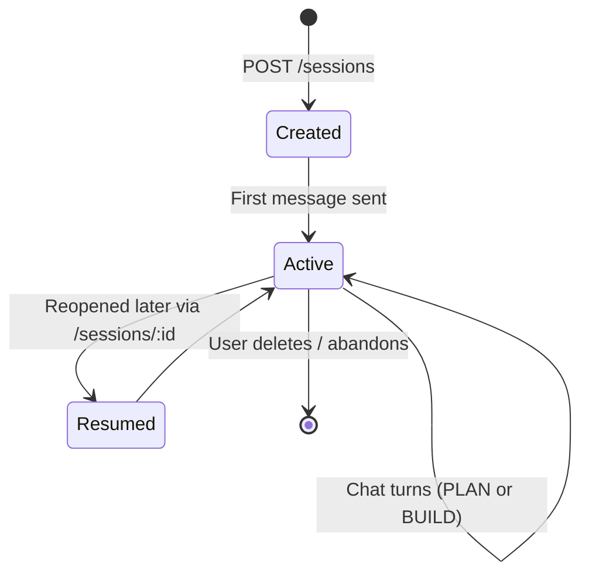
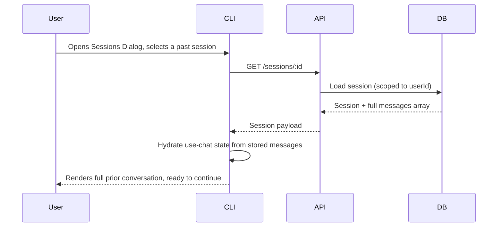

# Session & State Management

## 1. What a "Session" Is

A session is the unit of persistence in NightCode: one saved conversation,
scoped to one user, holding an ordered list of messages (user turns, assistant
turns, tool calls and results, and reasoning content where applicable). Sessions
are how a user resumes work — closing the terminal and reopening it later, or
switching machines entirely after logging in again, drops the user back into the
exact same conversation state.

## 2. Session Lifecycle

A session is created explicitly (via the New Session screen, giving it a title)
before any messages are sent — this means the Sessions Dialog always has a
meaningful, human-chosen title to display, rather than needing to derive one
from the first message after the fact.

## 3. Client-Side State vs. Server-Side State

| State                                           | Lives where                                                                           | Why                                                                                                                                                                                                                                       |
| ----------------------------------------------- | ------------------------------------------------------------------------------------- | ----------------------------------------------------------------------------------------------------------------------------------------------------------------------------------------------------------------------------------------- |
| Full message history                            | Server (Postgres)                                                                     | Durable, must survive across devices and CLI restarts.                                                                                                                                                                                    |
| In-flight streaming tokens for the current turn | Client (React state via `use-chat`)                                                   | Ephemeral by nature; only needs to exist while a response is actively streaming.                                                                                                                                                          |
| Selected mode (PLAN/BUILD) for the current turn | Client (`prompt-config` provider), persisted onto each message's metadata server-side | The _current_ selection is client-side UI state; the _historical_ mode used for each past turn is preserved permanently as part of that message's stored metadata, so a resumed session accurately shows which turns were PLAN vs. BUILD. |
| Selected model for the current turn             | Same pattern as mode                                                                  | Lets a user freely switch models mid-session while still being able to see, in history, exactly which model produced each past response.                                                                                                  |
| Auth token                                      | Client only (`~/.nightcode/auth.json`)                                                | Never persisted server-side as session state — see [Authentication & OAuth](./06-authentication-and-oauth.md).                                                                                                                            |

## 4. Merge-on-Write Persistence

When the client submits new messages to `/chat`, the server does not blindly
overwrite the stored history — it merges incoming messages into the existing
list by message ID, updating any message that already exists (for example, a
tool-call message whose result arrives in a follow-up request) and appending
anything new. This id-based merge is what allows a multi-step tool-calling turn
— several round trips between model and client as tools are invoked and resolved
— to be safely persisted incrementally without ever producing duplicate or
out-of-order messages in storage.

## 5. Why Persistence Waits for Turn Completion

The server only writes the merged message list back to the database once a turn
has fully finished streaming, was not aborted, and has no tool calls still
awaiting a result. This avoids ever persisting a "half-finished" assistant turn
that looks complete in storage but is actually mid-generation — if a user closes
their terminal mid-stream, the safe, well-defined recovery is that the turn
simply isn't saved, rather than saving a truncated, confusing partial response
that would be misleading on resume.

## 6. Resuming a Session

Resuming is a full state hydration, not a lazy/paginated load — consistent with
the JSON-document storage model described in
[Database Design](./04-database-design.md), the entire conversation loads in one
request, and the terminal UI renders the complete scrollback immediately.

## 7. Cross-Device Continuity

Because all session state lives server-side and is keyed only by the
Clerk-issued `userId`, a user who logs into NightCode on a second machine sees
the exact same list of sessions as on their first — there is no device pairing,
sync step, or local export/import required. This is a direct consequence of the
client holding no durable state of its own beyond the auth token.

## 8. Concurrency Considerations

Two simultaneous `/chat` requests against the same session (for example, the
same user running NightCode in two terminal tabs against one session) are not
explicitly locked against each other at the database level. In practice this is
an accepted, low-probability edge case for a single-user, human-paced
conversational product — the last write wins on the merged message list. Teams
extending NightCode toward multi-agent or automated concurrent workflows against
a single session should introduce optimistic concurrency control (an
`updatedAt`-based compare-and-swap on write) before relying on concurrent
writers.

## 9. Deleting Sessions

Session deletion is a straightforward authorized delete scoped to `id` +
`userId`, identical in shape to the read and update paths — there is no
soft-delete or retention policy beyond what the operator configures at the
database/backup level. Because messages are stored inline on the `Session` row
rather than in a separate table, deleting a session is always a single-row
delete with no cascading cleanup required.
