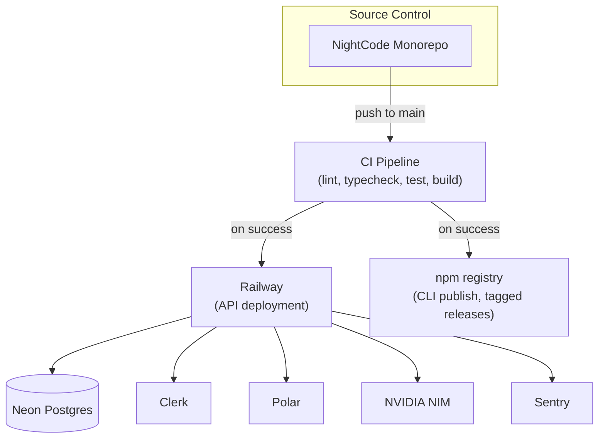
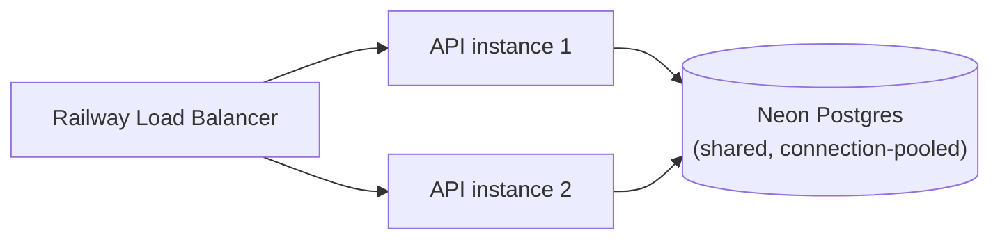

# Deployment & Infrastructure

## 1. Infrastructure Philosophy

NightCode is deliberately built to run on a small number of managed platforms
rather than self-hosted infrastructure — the goal is that a small team can
operate the entire backend (API, database, identity, billing, AI inference)
without running a single server, container orchestrator, or database cluster by
hand. Every piece of managed infrastructure is chosen because it maps directly
onto one architectural component from
[System Architecture](./01-system-architecture.md).

## 2. Infrastructure Map

| Component                | Provider                                      | Role                                                                                                                   |
| ------------------------ | --------------------------------------------- | ---------------------------------------------------------------------------------------------------------------------- |
| API hosting              | **Railway**                                   | Runs the Hono API server as a git-connected deployment; handles TLS termination, scaling, and zero-downtime redeploys. |
| Database                 | **Neon**                                      | Serverless PostgreSQL with connection pooling and instant branch databases for preview/staging environments.           |
| Identity                 | **Clerk**                                     | Fully managed OAuth identity provider; no self-hosted auth infrastructure.                                             |
| Billing / usage metering | **Polar**                                     | Fully managed billing, checkout, and usage-metering platform.                                                          |
| AI inference             | **NVIDIA NIM**                                | Fully managed inference hosting for the entire supported model catalog.                                                |
| Error monitoring         | **Sentry**                                    | Centralized error and performance monitoring across CLI and server.                                                    |
| CLI distribution         | npm registry (or equivalent package registry) | Publishes the `nightcode` package so users install via their package manager of choice.                                |

## 3. Deployment Topology

## 4. Environments

| Environment       | Purpose                             | Database                                 | Polar mode   | Notes                                                  |
| ----------------- | ----------------------------------- | ---------------------------------------- | ------------ | ------------------------------------------------------ |
| Local development | Individual engineer's machine       | Local or personal Neon branch            | `sandbox`    | `bun run dev:server` + `bun run dev:cli`               |
| Preview           | Per-pull-request review environment | Neon branch database (instant, isolated) | `sandbox`    | Spun up automatically per PR; torn down on merge/close |
| Production        | Live product                        | Primary Neon database                    | `production` | Deployed from `main` after CI passes                   |

Neon's branching model is what makes preview environments cheap and safe: each
pull request gets an isolated copy-on-write database branch rather than sharing
(and risking polluting) a single shared staging database.

## 5. API Server Deployment

The API is a single, stateless Hono application. Statelessness is what makes
horizontal scaling trivial — any instance can serve any request, because all
durable state lives in Neon and all session/identity/billing state is fetched
fresh from Clerk/Polar/the database on each request rather than cached in server
memory. Railway can run multiple instances behind its load balancer with no
sticky-session requirement.

## 6. Long-Lived Streaming Connections

AI chat responses stream over a single long-lived HTTP connection per turn, and
tool-calling turns can involve multiple round trips while a model works through
a multi-step task. The server's idle timeout is deliberately configured
generously (well above typical HTTP defaults) specifically so an in-progress
tool-calling exchange is never severed mid-flight by an overly aggressive
timeout — this is a small but important production tuning detail directly tied
to how the agent's tool-calling loop works.

## 7. Database Connection Management

Neon's serverless Postgres uses connection pooling (via a pooled connection
string) so that multiple concurrent API instances — and Neon's own autoscaling
of the underlying compute — don't exhaust Postgres's native connection limit.
Prisma is configured against the pooled connection string in every deployed
environment; the direct (unpooled) connection string is reserved for migration
tooling only.

## 8. CLI Release Process

1. A version bump and changelog entry land on `main`.
2. CI builds the CLI package for all supported platforms.
3. On a tagged release, the package is published to the npm registry under the
   `nightcode` package name.
4. Users on the latest installed version are notified of available updates via a
   lightweight version-check the CLI performs against the registry on startup
   (non-blocking, fails silently if offline).

## 9. Rollback Strategy

- **API:** Railway retains prior deployments; a bad deploy is rolled back by
  redeploying the previous known-good build, typically within seconds.
- **Database:** Neon's branching and point-in-time restore capability provide a
  safety net for schema migrations that need to be reverted; migrations should
  always be written to be backward-compatible with the currently-deployed API
  version for at least one release cycle (expand/contract pattern) to avoid
  requiring simultaneous API + schema rollback.
- **CLI:** because the CLI auto-checks for updates but never force-upgrades a
  running session, a bad CLI release can be unpublished/deprecated on the
  registry without breaking already-installed users mid-session.

## 10. Scaling Considerations

The two components most likely to need active scaling attention as usage grows
are the API server (horizontal scaling via more Railway instances, which is
close to free given statelessness) and the pooled NVIDIA NIM allowance (which
may require negotiating higher throughput tiers directly with NVIDIA as the
free-tier user base grows) — the
[Usage Limits & Billing](./09-usage-limits-and-billing.md) fair-use gating
exists specifically to keep the second constraint manageable as the first scales
up.
