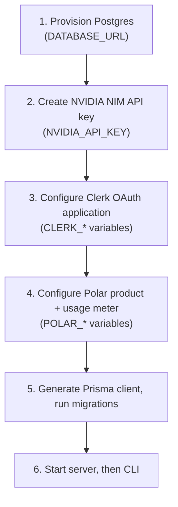

# Environment Configuration

## 1. Overview

NightCode's server and CLI are both configured entirely through environment variables — no configuration files with secrets are checked into source control. A documented `.env.example` at the repository root lists every variable required to run the full system locally.

## 2. Full Variable Reference

| Variable | Used by | Required | Description |
|---|---|---|---|
| `API_URL` | CLI, server | Yes | Base URL the CLI targets for all API calls, and the base used to construct the OAuth redirect URI (`API_URL/auth/callback`). Defaults to `http://localhost:3000` in local development. |
| `DATABASE_URL` | Server, database package | Yes | PostgreSQL connection string (pooled connection string in deployed environments; direct connection for migrations). |
| `NVIDIA_API_KEY` | Server | Yes | Server-held API key for NVIDIA NIM's OpenAI-compatible endpoint. Never exposed to the CLI. |
| `CLERK_FRONTEND_API` | CLI, server | Yes | Clerk's frontend API URL, used to construct the OAuth authorize/token endpoints. |
| `CLERK_OAUTH_CLIENT_ID` | CLI | Yes | Public client ID for the registered Clerk OAuth application. |
| `CLERK_OAUTH_CLIENT_SECRET` | Server | Yes | Used server-side when relaying/validating the OAuth callback. |
| `CLERK_PUBLISHABLE_KEY` | Server | Yes | Clerk publishable key for backend SDK initialization. |
| `CLERK_SECRET_KEY` | Server | Yes | Clerk secret key used to verify bearer tokens on every protected request. |
| `JWT_SECRET` | Server | Yes | Signing/verification secret for any internally issued short-lived tokens. |
| `POLAR_ACCESS_TOKEN` | Server | Yes | Polar API access token for checkout, portal, and usage-ingestion calls. |
| `POLAR_PRODUCT_ID` | Server | Yes | Product ID representing the Pro subscription plan. |
| `POLAR_SERVER` | Server | Yes | `sandbox` for local/preview, `production` for live billing. |
| `POLAR_USAGE_METER_ID` | Server | Yes | Meter ID tracking free-tier daily request allowance consumption. |

## 3. Example `.env` Template

```bash
API_URL=http://localhost:3000

DATABASE_URL=

NVIDIA_API_KEY=

CLERK_FRONTEND_API=
CLERK_OAUTH_CLIENT_SECRET=
CLERK_OAUTH_CLIENT_ID=
CLERK_PUBLISHABLE_KEY=
CLERK_SECRET_KEY=
JWT_SECRET=jwt-secret

POLAR_ACCESS_TOKEN=
POLAR_PRODUCT_ID=
POLAR_SERVER=sandbox
POLAR_USAGE_METER_ID=
```

## 4. Setup Order

Because several of these values depend on external dashboard configuration completed in a specific order, first-time setup should proceed:



## 5. Clerk OAuth Application Setup

1. In the Clerk dashboard, go to **Configure → Developers → OAuth applications** and add a new OAuth application.
2. Select scopes: `openid`, `email`, `profile`, `offline_access`.
3. Enable **Public** (required for the Authorization Code + PKCE flow the CLI uses).
4. Enable **Consent screen**.
5. Add `http://localhost:3000/auth/callback` as a redirect URI for local development, and the deployed production callback URL as an additional redirect URI.
6. Copy the generated client ID, client secret, frontend API URL, publishable key, and secret key into the corresponding environment variables.

## 6. Polar Setup

1. In sandbox mode, create a usage meter tracking one event per completed chat turn/session creation (this is what backs the free-tier daily allowance).
2. Create a Pro subscription product and note its product ID.
3. Set the customer portal to private so subscription management happens exclusively through API-generated portal links rather than a publicly discoverable URL.
4. Copy the access token, product ID, server mode, and meter ID into the corresponding environment variables.

## 7. NVIDIA NIM Setup

1. Create (or use an existing) NVIDIA developer account.
2. Generate an API key scoped for NIM inference access.
3. Verify the target models from the [supported model registry](./07-ai-model-integration.md) are available on the free tier for that account.
4. Set `NVIDIA_API_KEY` — this single key is shared across all NightCode users; it is never distributed to the CLI or any client.

## 8. Database Setup

```bash
# generate the Prisma client
bun run --cwd packages/database db:generate

# apply the schema to the configured database
bunx prisma migrate deploy   # production
bunx prisma migrate dev      # local development, interactive
```

## 9. Secrets Handling Guidance

- Never commit a populated `.env` file — only `.env.example` (with empty values) belongs in source control.
- In deployed environments, set every variable through the hosting platform's secret management (Railway environment variables), not through a checked-in file.
- Rotate `CLERK_SECRET_KEY`, `NVIDIA_API_KEY`, and `POLAR_ACCESS_TOKEN` on a defined schedule and immediately upon any suspected exposure, since all three are server-held secrets with direct access to identity verification, pooled inference capacity, or billing operations respectively.

## 10. Verifying a Local Setup

After completing configuration:

```bash
bun install
bun run dev:server     # in one terminal — should report "listening on :3000"
bun run dev:cli         # in another terminal
```

A successful local setup is confirmed by: running `nightcode`, completing the browser-based login, creating a new session, and receiving a streamed response from a free-tier NVIDIA model in PLAN mode.
