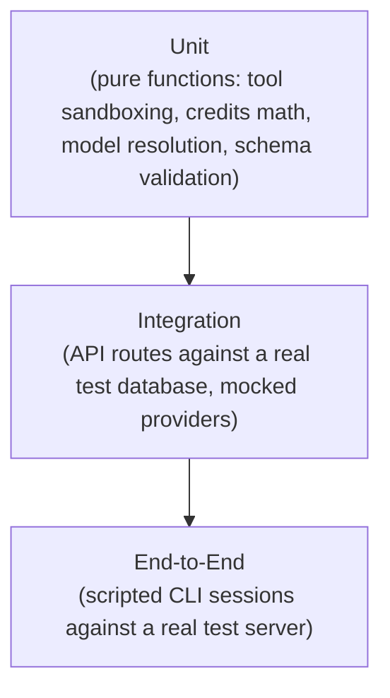

# Testing Strategy

## 1. Testing Philosophy

NightCode's highest-risk surfaces are not typical CRUD logic — they're the filesystem sandbox boundary, the mode-gating between PLAN and BUILD, the merge-on-write session persistence, and the usage-allowance gate. Testing effort is weighted deliberately toward those areas rather than spread evenly across the codebase, because a bug in sandboxing or mode enforcement has a materially different (and higher) severity than a bug in, say, theme rendering.

## 2. Test Pyramid

The pyramid is intentionally bottom-heavy: the majority of tests are fast, deterministic unit tests around pure logic, with a smaller layer of integration tests exercising real HTTP routes against a real (ephemeral) database, and a thin top layer of true end-to-end tests.

## 3. Unit Test Coverage Priorities

| Area | What's tested |
|---|---|
| `resolveInsideCwd` (path sandboxing) | Every path-traversal shape (`../`, absolute paths, symlink edge cases) is rejected; every legitimate relative path within the project resolves correctly. |
| Tool mode gating | PLAN mode never exposes write/exec tool contracts; BUILD mode exposes the full set; the client-side executor independently refuses a write/exec tool call even if (hypothetically) requested during PLAN. |
| `editFile` precision | Zero matches errors clearly; multiple matches errors with the correct count; exactly one match succeeds. |
| Credits/allowance calculation | Free-tier request counting, idempotent usage ingestion via `eventId`, correct behavior at exactly zero remaining allowance. |
| Model registry resolution | Every supported model ID resolves to a valid provider instance; unsupported IDs are rejected; premium-tier models are correctly gated for non-Pro users. |
| Zod schema validation | Every shared schema (`toolInputSchemas`, chat submit schema, session creation schema) rejects malformed input with clear errors. |
| OAuth state encode/decode | Round-trips correctly; tampered or malformed state is rejected; nonce mismatch is detected. |

## 4. Integration Test Coverage Priorities

| Area | What's tested |
|---|---|
| `/sessions` routes | Create, list, and fetch are correctly scoped per-user; cross-user access attempts return `404`, not data leakage. |
| `/chat` route | End-to-end request against a mocked NVIDIA NIM provider (fixed streamed response) verifies persistence, merge-on-write behavior, and usage ingestion all happen correctly after a turn completes. |
| Auth middleware | Missing, expired, and malformed tokens are uniformly rejected across every protected route. |
| Allowance middleware | Requests are correctly blocked once allowance is exhausted, and correctly allowed for Pro accounts regardless of counter state. |
| Billing routes | Checkout/portal URL creation calls the billing provider with the correct `externalCustomerId` and returns the expected shape. |

External providers (Clerk, Polar, NVIDIA NIM) are mocked at the integration layer using recorded or hand-written fixture responses — integration tests should never depend on live third-party services to pass reliably in CI.

## 5. End-to-End Test Coverage

A small number of true end-to-end tests script a realistic user journey against a fully running (test) server: login flow simulation, session creation, sending a message and receiving a streamed response, switching from PLAN to BUILD, and executing a local tool call against a temporary scratch project directory. These are the slowest and most brittle tests in the suite by nature, so they're kept few and focused on the critical path rather than exhaustive scenario coverage.

## 6. Manual/Exploratory Testing Checklist

Some product qualities are best verified by a human directly operating the terminal UI before a release ships:

- [ ] Fresh install → login → first message works with zero prior configuration beyond environment setup.
- [ ] Mode switch mid-session preserves context and visibly updates the status bar.
- [ ] A large file read is visibly truncated with a clear indicator, not silently cut off.
- [ ] An ambiguous `editFile` call surfaces a clear, actionable error the model can recover from.
- [ ] Hitting the free-tier allowance produces a clear, non-alarming message with an obvious next step (`/upgrade`).
- [ ] Theme switching applies instantly across every visible component.
- [ ] Resuming an old session renders full scrollback correctly, including past tool calls and reasoning content.

## 7. CI Enforcement

Every pull request runs, at minimum: type checking across all packages (shared types must stay consistent), linting, the full unit and integration suite, and a production build of both the CLI and server packages. A pull request cannot merge with a red build — see [CI/CD Pipeline](./17-cicd-pipeline.md) for the full pipeline definition.

## 8. Testing the Sandboxing Boundary Specifically

Because filesystem sandboxing is the single highest-consequence piece of logic in the system, it is tested with an explicit, maintained table of adversarial inputs rather than a handful of ad hoc cases — path traversal via `..`, absolute paths, mixed separators, and encoded traversal sequences are all included, and any newly discovered bypass technique is added to this table permanently once fixed, so it can never silently regress.

## 9. Non-Goals

Testing does not attempt to evaluate the *quality* of AI-generated responses (that's a model-evaluation concern, not a software-correctness concern) — the test suite verifies that the pipeline correctly transports, persists, and gates requests and responses, not that a given NVIDIA-hosted model produced a "good" answer to a given prompt.
