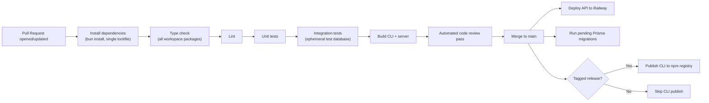

# CI/CD Pipeline

## 1. Pipeline Goals

The pipeline exists to make three guarantees on every change: nothing that fails to type-check, lint, or test reaches `main`; nothing that reaches `main` fails to build; and a passing build on `main` can be deployed with a single, repeatable action rather than a manual, error-prone release ritual.

## 2. Pipeline Stages

## 3. Pull Request Checks

Every pull request triggers, in order:

1. **Install** — single `bun install` resolves the entire workspace from the shared lockfile.
2. **Type check** — `tsc --noEmit` (or equivalent) runs across every package, catching any drift in shared types between the CLI, server, database, and shared packages before anything else runs.
3. **Lint** — static analysis for code style and common bug patterns.
4. **Unit + integration tests** — see [Testing Strategy](./16-testing-strategy.md) for coverage priorities; integration tests spin up an ephemeral Neon branch database scoped to that pull request's CI run and tear it down after.
5. **Build** — both the CLI and server packages are built exactly as they would be for a release, catching build-time errors (bundling issues, missing exports) that type checking alone wouldn't surface.
6. **Automated code review** — a review bot flags risky patterns, potential bugs, and style issues directly on the pull request as an additional signal alongside human review, before merge.

A pull request cannot be merged until all of these pass — this is enforced at the branch-protection level, not by convention.

## 4. Preview Environments

Each pull request that touches server or database code gets an isolated preview deployment: a Neon branch database (instant, copy-on-write from production schema) paired with a preview API deployment on Railway, both scoped to that PR and automatically torn down when the PR is closed or merged. This lets reviewers and the PR author exercise real API behavior — including database migrations — against isolated data before anything touches production.

## 5. Deployment to Production

Merging to `main` triggers, in order:

1. **Migrate** — any pending Prisma migrations are applied to the production database (`prisma migrate deploy`) before the new API version that depends on them goes live.
2. **Deploy API** — Railway builds and deploys the new server version, replacing the previous deployment with zero-downtime rollout (new instances become healthy and receive traffic before old instances are retired).
3. **CLI publish (tagged releases only)** — a version-tagged commit on `main` additionally triggers a build and publish of the CLI package to the npm registry.

Database migrations are applied before the corresponding API code deploys specifically so the new code never runs against an old schema — migrations are written to be backward-compatible with the *previous* API version for at least one release cycle (expand/contract pattern), so a brief window where old API code runs against the new schema is always safe.

## 6. Release Versioning

The CLI and server are versioned together from the monorepo (a single version bump per release), since they're developed and deployed in lockstep and the typed RPC client between them assumes matching route contracts at any given commit. A CLI version published to npm always corresponds to a server version already live in production by the time that release goes out, so users updating their CLI are never ahead of the API they're talking to.

## 7. Rollback Procedure

| Failure point | Rollback action |
|---|---|
| Bad API deploy | Redeploy the previous Railway build (retained automatically); typically completes in seconds. |
| Bad migration | Roll forward with a corrective migration where possible (Postgres migrations are rarely safely reversible in place); Neon's point-in-time restore is the last-resort safety net. |
| Bad CLI release | Deprecate/unpublish the bad version on the registry; already-installed users are unaffected until they next update, since the CLI never force-upgrades mid-session. |

## 8. Secrets in CI

CI runners never have access to production secrets (`NVIDIA_API_KEY`, `CLERK_SECRET_KEY`, `POLAR_ACCESS_TOKEN` for the live environment) — integration tests run against sandbox/test credentials for Clerk and Polar and a mocked NVIDIA NIM provider, and deployment credentials for Railway/npm are scoped to a dedicated CI service identity with the minimum permissions needed to deploy, not broad account access.

## 9. Why Automated Code Review Is a Pipeline Stage, Not Just a Human Habit

Running automated review on every pull request catches an entire category of issues (unused variables slipping through, inconsistent error handling, risky patterns in newly-added tool execution code) before a human reviewer's attention is spent on them — freeing human review to focus on architectural fit, product correctness, and the specific risk areas (sandboxing, mode gating, allowance logic) that automated tools are least equipped to reason about deeply.

## 10. Continuous Improvement

Pipeline duration and flakiness are tracked over time; any test that fails intermittently without a code change is treated as a bug in the test (or the system it exercises) to be fixed promptly, not muted or retried into passing — a flaky pipeline erodes the entire guarantee this section opened with.
